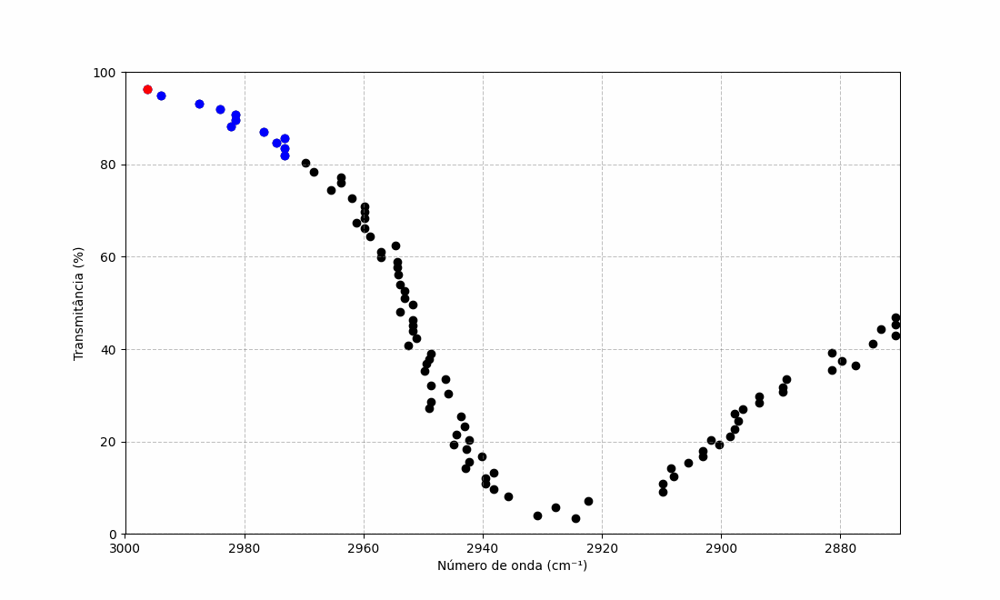

# Usage Guide

## Overview

**Spectral Nexus** is an interactive web application that helps you identify chemical compounds by comparing FT-IR spectra using a custom algorithm and a free spectral database.

The workflow is simple:

1. **Upload** a spectrum (`.csv` format).
2. **Analyze** the spectrum using the matching algorithm.
3. **Review** the top 5 closest candidates via charts.
4. **Download** a detailed report in `PDF` format.

---

## Interface Tour

The web app consists of the following main sections:

- **Home**: Upload your FT-IR spectrum file (`.csv`) and configure processing options before analysis.
- **Reports** _(Relatórios)_: View and download results in a comprehensive `PDF` format.

---

## Uploading Data

1. Go to the **Home** page.
2. Choose your `.csv` file containing the FT-IR data.
3. Click on **Choose file** _(Escolher arquivo)_ to submit it.
4. 

> 💡 The `.csv` must have two columns: **Wavenumber (x)** and **Absorbance (y)**.

---

## Advanced Configurations

For greater control over the analysis, **Spectral Nexus** offers several advanced configuration options designed to optimize performance and improve the quality of spectral processing.

### Parallel Processing

- You can enable **multi-core processing** to accelerate computations by leveraging multiple CPU cores — ideal for large datasets or batch processing.

### Custom Analysis Range

You can specify a custom **wavenumber range** to be used during the band filtering stage. This allows the algorithm to focus on the most chemically informative regions of the FT-IR spectrum and discard irrelevant noise.

The tool performs a **local minima search** using a sliding window centered around each point in the spectrum. The window size determines how far before and after each point the algorithm looks to identify significant peaks.

- The default window is **±25 cm⁻¹**, as it provided the best performance during testing.
- You can adjust this range in the interface.

A band is considered relevant if it has the highest **relative transmittance** within the specified range on both sides, marking it as a prominent band suitable for compound identification.

*Figure: Animated example of the filtering process used to identify relevant spectral bands.*

### Baseline Correction (airPLS Algorithm)

**Spectral Nexus** uses the **adaptive iteratively reweighted penalized least squares (airPLS)** algorithm for baseline correction. You can adjust the following parameters:

- `lambda_`: Controls the **smoothing intensity** of the baseline. Higher values result in a smoother correction.
- `porder`: Defines the **order of the penalty**, allowing finer tuning for gradual curvature changes or smoother transitions.
- `itermax`: Sets the **maximum number of iterations** allowed during the baseline adjustment process.

> 💡 Fine-tuning these parameters can significantly improve the reliability of compound matching in noisy or complex spectra.

---

## Downloading Report

Once the analysis is complete, you can generate a detailed PDF report with your results.

### Steps

1. Navigate to the **Reports** tab.
2. Click **Download Report** _(Download Relatório)_ to export the results.

### Report Contents

The generated PDF includes:

- **Candidate Table**  
  A ranked list of the top matched compounds with similarity scores.

- **Overlaid Spectra Plots**  
  Visual comparison between your input spectrum and each of the top matches.

- **Metadata**  
  Information such as timestamp, preprocessing parameters used, and configuration details.

> 💡 Make sure you've run an analysis before attempting to download the report. The **Reports** tab is enabled only after a successful analysis.

---

## Tips & Troubleshooting

- Ensure your uploaded `.csv` is correctly formatted.
- The "**Reports**" tab is only enabled after a successful analysis.
- If no matches are found, the compound may not exist in the reference database, or the resolution of the uploaded FT-IR spectrum may differ significantly from the database spectra.

---

## Questions or Feedback?

If you encounter issues or have suggestions, feel free to [open an issue](https://github.com/jgmotta98/spectral-nexus/issues) or reach out via [GitHub Discussions](https://github.com/jgmotta98/spectral-nexus/discussions).

---